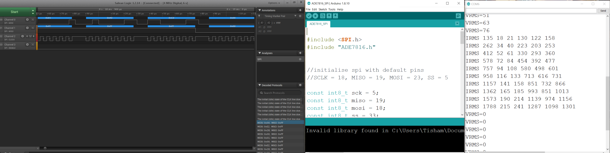
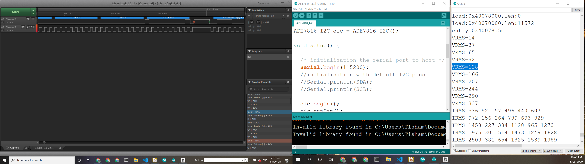

# ADE7816 SPI Arduino Driver

# ADE7816 I2C Arduino Driver

This is an Arduino Library to read ADE7816 Energy Monitor ASIC from Arduino compatible microcontrollers.
The driver supports :
- SPI mode for energy reading
- SPI mode for DSP raw data access
- I2C mode for energy reading

The code here is inspired by Javascript implementation [here](https://github.com/tadakado/smart-meter/tree/master/Soft) and C implementation [here](https://github.com/andrew-gillan/energon/blob/master/scr/ADE7816.c).

## Supported Hardware

This driver has been tested with the [ADE7816 Breakout](https://github.com/whatnick/ADE7816_Breakout), available on :
- [Tindie](https://www.tindie.com/products/whatnick/ade7816-breakout/)
- [PCBWay](https://www.pcbway.com/project/shareproject/Breakout_Board_for_ADE7816_6_Channel_Energy_Monitor_ASIC.html)
- [OSHPark](https://oshpark.com/shared_projects/oovHySXk)
- [Aisler](https://aisler.net/p/CQWPJEKM)